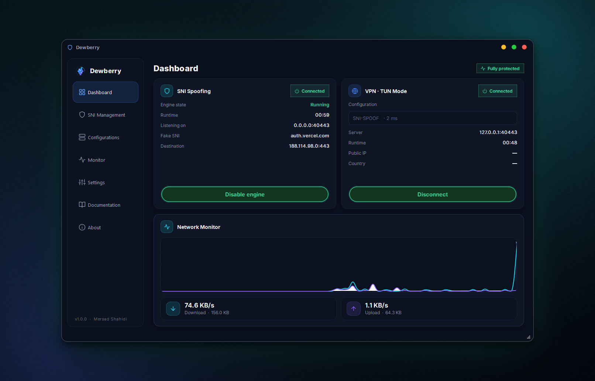
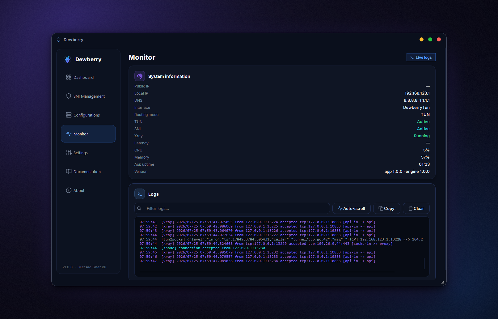
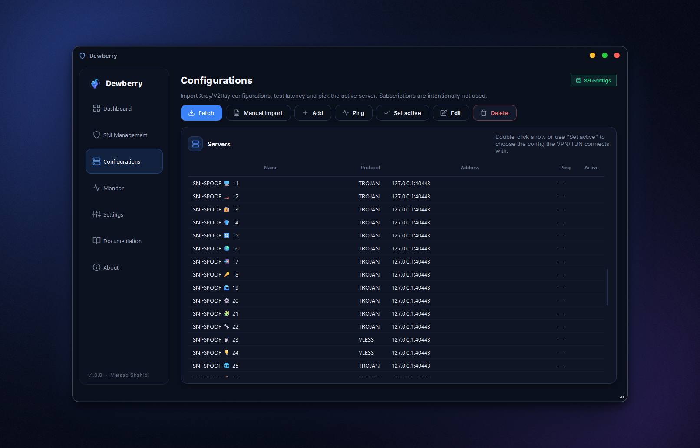

<div align="center">


# Dewberry

**Unified secure tunneling.**

SNI spoofing and Xray/V2Ray + TUN connectivity, unified into one cohesive
desktop client for Windows — the flagship of the Mulberry family.

<br>

[](https://github.com/sadult/dewberry/releases/latest)
[](https://github.com/sadult/dewberry/releases)
[](LICENSE.txt)
[](https://github.com/sadult/dewberry/stargazers)

[](https://github.com/sadult/dewberry/releases/latest)
[](https://www.python.org)
[](https://www.qt.io)
[](https://github.com/XTLS/Xray-core)
[](https://github.com/sadult/dewberry/pulls)

<br>

[**⬇️ Download**](https://github.com/sadult/dewberry/releases/latest) · [**🌐 Website**](https://mercads.ir/hub) · [**✨ Features**](#-features) · [**🖼 Screenshots**](#-screenshots) · [**🚀 Getting started**](#-getting-started) · [**💬 Telegram**](https://t.me/bitologist)

<br>



</div>

---

## ✨ Highlights

| | | |
|---|---|---|
| 🛡 **Native Shade engine** — in‑process SNI spoofing, no companion executable | ⚡ **Full Xray core** — VLESS, VMess, Trojan, Shadowsocks, REALITY, XTLS | 🖥 **Proxy & TUN modes** — system proxy or full‑device Wintun tunnel |
| 🧩 **One app, two engines** — spoof SNI and tunnel through Xray at the same time | 📊 **Bento Grid dashboard** — live traffic graph, system info and logs at a glance | 🎛 **Fully editable SNI config** — listen host/port, fake SNI, destination — validated live |
| 🗂 **No subscriptions, by design** — Fetch from GitHub, Manual Import, or paste a share‑link | 📜 **Live core logs** — filterable, real‑time console | 🎨 **Premium dark UI** — frameless window, unified design system |

---

## 📖 Table of contents

- [What is Dewberry?](#-what-is-dewberry)
- [Features](#-features)
- [Screenshots](#-screenshots)
- [Architecture](#-architecture)
- [Getting started](#-getting-started)
- [Build from source](#-build-from-source)
- [Quick start](#-quick-start)
- [Default SNI configuration](#-default-sni-configuration)
- [Troubleshooting](#-troubleshooting)
- [Privacy](#-privacy)
- [Third-party components](#-third-party-components)
- [License](#-license)

---

## 🍇 What is Dewberry?

Dewberry is a first‑class Windows desktop application — the sister product of
**Mulberry** — that unifies two technologies into a single seamless
experience:

- **Shade engine (native SNI spoofing)** — forges a TLS ClientHello with a
  configurable SNI and forwards it to a chosen destination. Inside Dewberry it
  runs as an **in‑process subsystem**, with no companion executable.
- **Xray/V2Ray + TUN** — the full networking stack inherited from Mulberry: a
  stable Windows TUN implementation, a share‑link parser, routing, DNS and the
  connection engine itself.

Enable the SNI engine, connect to an Xray configuration and route all system
traffic through TUN — entirely inside one app, one window, one dashboard.

---

## ✨ Features

### 🛡 SNI spoofing (Shade engine)

- **Fully native** — runs in‑process on its own background thread, no bundled
  helper binary
- Every field editable with **inline validation**: listen host/port, fake SNI,
  destination IP/port
- **Save**, **restore defaults**, **import** and **export** as JSON
- Fields lock automatically while the engine is running, so the live tunnel is
  never mutated underneath itself

### 🔌 Connectivity (Xray / TUN)

- **Full Xray core** — the complete, unmodified [Xray-core](https://github.com/XTLS/Xray-core) engine
- **Protocols**: VLESS · VMess · Trojan · Shadowsocks — including **REALITY** and **XTLS-Vision**
- **Proxy** or **TUN mode** with one click — system proxy for browsers/apps, or
  a full‑device Wintun tunnel for everything else
- Local **SOCKS5** and **HTTP** inbounds, fully configurable

### 🗂 Configuration management

- **Fetch** — pull a `configs.md` list straight from a GitHub raw URL
- **Manual import** — load a local `configs.md` file sitting beside the app
- **Add from clipboard** — paste any `vless://`, `vmess://`, `trojan://`, `ss://` link
- **TCP ping**, per‑server or for the whole list, with color‑coded latency
- No subscription engine — by design, kept simple and auditable

### 📊 Dashboard & monitoring

- **Bento Grid dashboard** — SNI control, VPN/TUN control, live traffic graph
  and system information in one glance
- **Live traffic graph** with upload/download counters and session duration
- **Integrated log console** with real‑time filtering
- Dedicated **Monitor** page for deeper system and connection detail

### 🎨 Experience

- **Premium dark UI** with a frameless window and a single unified design system
- **Documentation & About pages** built into the app — quick start, tutorials,
  troubleshooting, FAQ, credits, license and a plain‑language privacy statement
- **Zero telemetry** — nothing about your usage ever leaves your device

---

## 🖼 Screenshots

<div align="center">

### Dashboard — Bento Grid, connected through TUN mode


<br><br>

### Live Monitor — native Shade engine configuration & professional monitor and log system



<br><br>

### Configurations — fetch, import & ping test



</div>

---

## 🔧 Architecture

Dewberry is organised into strictly separated layers — the UI never touches
the network directly; it only talks to `ConnectionManager` and
`SniController`, which expose thread‑safe Qt signals.

```
dewberry/
├─ core/                 # networking + business logic
│  ├─ connection.py      # Xray + Proxy/TUN orchestrator
│  ├─ xray.py            # Xray-core process + config builder
│  ├─ tun.py             # Windows TUN adapter (DewberryTun)
│  ├─ routing.py         # routing + DNS rules
│  ├─ proxy.py           # system proxy (WinINET)
│  ├─ links.py           # share-link parser (vless/vmess/trojan/ss/...)
│  ├─ ping.py            # TCP ping / URL test
│  ├─ sni_engine.py      # native Shade SNI engine (in-process)
│  ├─ sni_controller.py  # Qt controller for the SNI engine
│  └─ configs.py         # GitHub fetch + configs.md import
├─ storage/store.py      # JSON persistence (settings, servers, sni)
├─ utils/                # paths, icons, fonts, sysinfo
└─ ui/                   # presentation layer
   ├─ widgets/           # unified design-system components
   └─ pages/             # Dashboard, SNI, Configs, Monitor, Settings, Docs, About
```

```
┌──────────────────────────────────────────────────┐
│                   Dewberry UI                    │
│         (PySide6 · frameless · single window)    │
└───────────────────┬──────────────────────────────┘
                    │ manages
        ┌───────────┼─────────────┐
        ▼                          ▼
  ┌───────────┐             ┌───────────────┐
  │   Shade   │             │  Xray core    │
  │ SNI engine│             │  + TUN/Wintun │
  └───────────┘             └───────────────┘
```

---

## 🚀 Getting started

### Requirements

| | Minimum |
|---|---|
| **OS** | Windows 10 / 11 (64-bit) |
| **RAM** | 4 GB |
| **Disk** | ~200 MB free space |
| **Privileges** | Administrator — only for TUN mode and the SNI engine's packet driver |

### Install

1. Grab the latest **installer** or **portable** build from the
   [**Releases page**](https://github.com/sadult/dewberry/releases/latest)
2. Run it — Dewberry ships **self‑contained**: place `xray`, `tun2socks`,
   `wintun.dll`, `geoip.dat` and `geosite.dat` in a `core/` folder beside the
   executable (or `%APPDATA%/Dewberry/core`)
3. Launch Dewberry, add a configuration and hit **Connect** 🍇

> [!TIP]
> The portable build runs from any folder — the `core/` directory just needs to sit next to `Dewberry.exe`.

---

## 🛠 Build from source

```bat
:: 1. Clone
git clone https://github.com/sadult/dewberry.git
cd dewberry

:: 2. Install dependencies
pip install -r requirements.txt

:: 3. Run from source
python main.py

:: 4. …or build a distributable exe (PyInstaller)
scripts\build_windows.bat
```

> [!NOTE]
> The TUN adapter and the SNI packet driver are **Windows‑only** and require
> Administrator rights. The interface and configuration management run on any
> platform for development.

The build script produces a self‑contained `dist/Dewberry/Dewberry.exe`. See
`build/dewberry.spec` for the PyInstaller configuration.

---

## ⚡ Quick start

1. **Add a configuration** — open *Configurations* and use **Fetch** (a GitHub URL), **Manual Import** (a `configs.md` file), or **Add** to paste a share‑link
2. **Test** — run **Ping** to measure latency, then select a row and press **Set active** (or double‑click it)
3. **Tune the SNI engine** *(optional)* — open *SNI Management* to adjust the listen address, fake SNI and destination; the defaults work as‑is
4. **Connect** — on the *Dashboard*, enable the SNI engine and/or connect the VPN in **Proxy** or **TUN** mode, then watch the live traffic graph fly 🍇

---

## 🧬 Default SNI configuration

```json
{
  "LISTEN_HOST": "0.0.0.0",
  "LISTEN_PORT": 40443,
  "FAKE_SNI": "auth.vercel.com",
  "CONNECT_IP": "188.114.98.0",
  "CONNECT_PORT": 443
}
```

Every value above is editable from **SNI Management**, with **Save**,
**Restore defaults**, **Import** and **Export** available at all times.

---

## 🩺 Troubleshooting

| Problem | Fix |
|---|---|
| **TUN mode won't start** | Run Dewberry as **Administrator** — creating the adapter needs elevation |
| **SNI engine won't start** | Requires the WinDivert driver via `pydivert` and Administrator rights |
| **No internet after a crash** | Open Dewberry and disconnect once — proxy & routes are restored automatically |
| **All pings time out** | Check your internet first; some networks block TCP probes |
| **A specific app ignores the proxy** | Switch to **TUN mode** — it captures all traffic at the network layer |
| **Fetch won't update** | Verify the raw URL is reachable and returns a valid `configs.md` |
| **Windows SmartScreen warning** | The exe is unsigned — click *More info → Run anyway*, or build from source |

Still stuck? [**Open an issue**](https://github.com/sadult/dewberry/issues) with your log output (*Monitor* page → copy).

---

## 🔒 Privacy

Dewberry runs entirely on your device:

- ❌ No telemetry, no analytics, no crash reporting
- ❌ No accounts, no cloud sync
- ✅ Configurations, SNI settings and logs stay in a local per‑user folder
- ✅ Nothing leaves your machine except the network traffic you explicitly route through your own servers
- ✅ Fully auditable — every component is open source

---

## 📦 Third-party components

| Component | License |
|---|---|
| [Xray-core](https://github.com/XTLS/Xray-core) | MPL-2.0 |
| [tun2socks](https://github.com/xjasonlyu/tun2socks) | GPL-3.0 |
| [Wintun](https://www.wintun.net) | Prebuilt Binaries License |
| [WinDivert](https://reqrypt.org/windivert.html) | LGPL-3.0 / GPL-3.0 |
| [Inter](https://github.com/rsms/inter) | OFL-1.1 |
| [PySide6 / Qt](https://www.qt.io) | LGPL-3.0 |

---

## 📄 License

**[PolyForm Noncommercial 1.0.0](LICENSE.txt)** — free for personal, noncommercial use.
Copyright (c) 2026 Mersad Shahidi.

---

<div align="center">

Made with 💜 by [**Mersad Shahidi**](https://github.com/sadult)

[💬 Telegram](https://t.me/bitologist) · [✉️ mercvd@icloud.com](mailto:mercvd@icloud.com) · [🌐 Website](https://mercads.ir/hub)

⭐ **If Dewberry helps you, a star means a lot!**

</div>
